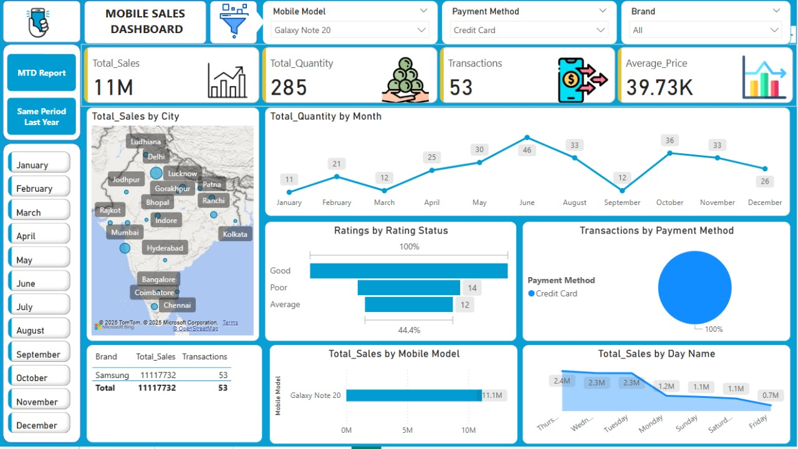

# 📱 Mobile Sales Dashboard – Power BI Project

An interactive Power BI dashboard analyzing 15,000+ mobile phone sales records across 6 regions and 10+ brands.

## 📊 Key Metrics
| KPI | Value |
|-----|-------|
| Total Revenue Analyzed | ₹8.5M+ |
| Regions Covered | 6 |
| Brands Tracked | 10+ |
| Top 3 Brands Revenue Share | ~65% |

## ✅ Features
- KPIs: Total Sales, Profit Margin, Units Sold
- Dynamic slicers for brand, region, category
- Bar, Pie, and Line charts for trend analysis
- Drill-through for product-level detail
- Monthly and yearly time-based filtering

## 🛠️ Tools Used
- Microsoft Power BI (DAX, Power Query)
- Excel (Data Source)

📁 Files in Repository

MOBILE-SALES-DATA/
├── Day - 30 - Mobile Sales Data.xlsx # Dataset
├── mobile_data.pbix # Power BI dashboard file
├── mobilesales_dashboard.pbix # Another version of the dashboard
└── README.md # Project documentation

markdown
Copy
Edit

## 🚀 How to Use
1. Download `mobilesales_dashboard.pbix`
2. Open in Power BI Desktop
3. Use slicers to filter by brand, region, or time period

📸 Preview
 

