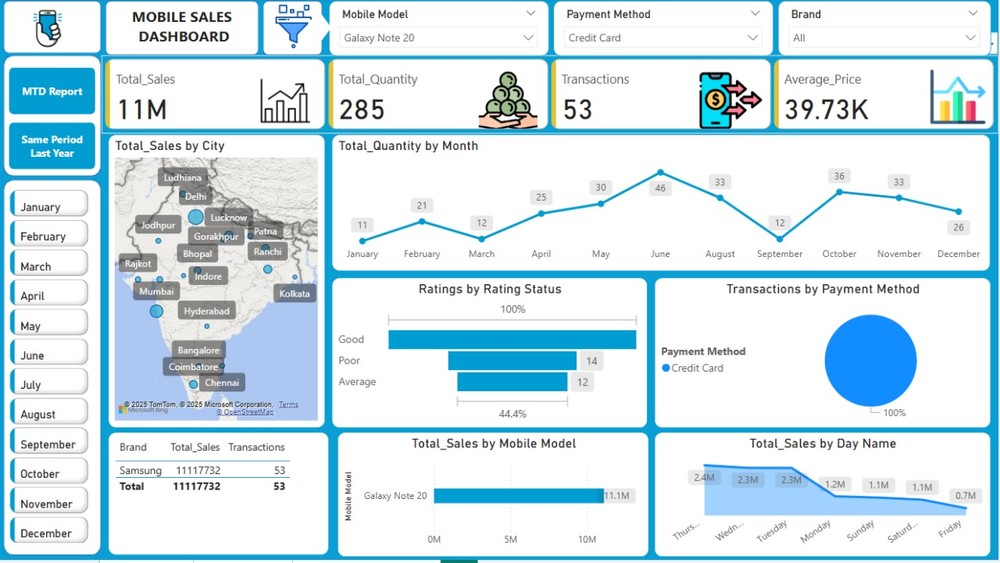

# 📱 Mobile Sales Dashboard – Power BI Project

This project is a Power BI dashboard built to analyze mobile phone sales data. It helps visualize key business metrics across different brands, categories, and regions using interactive charts and KPIs.

## 📌 Features

- ✅ KPIs: Total Sales, Profit, Units Sold
- 📊 Visualizations: Bar Charts, Pie Charts, Line Graphs
- 🗂️ Brand and Category-wise filtering
- 🌍 Region-wise sales comparison
- 📅 Time-based filtering for monthly and yearly analysis
- 🔍 Slicers and drill-through for better interactivity

🧰 Tools Used

- Microsoft Power BI
- Excel (`Day - 30 - Mobile Sales Data.xlsx`)
- Power Query & DAX (for calculations and modeling)

📁 Files in Repository

MOBILE-SALES-DATA/
├── Day - 30 - Mobile Sales Data.xlsx # Dataset
├── mobile_data.pbix # Power BI dashboard file
├── mobilesales_dashboard.pbix # Another version of the dashboard
└── README.md # Project documentation

markdown
Copy
Edit

🏁 How to Use

1. Clone or download the repository.
2. Open `.pbix` file(s) in Power BI Desktop.
3. Review the visuals or connect your own dataset.
4. Use slicers to interact with different views of the data.

📸 Preview
 

